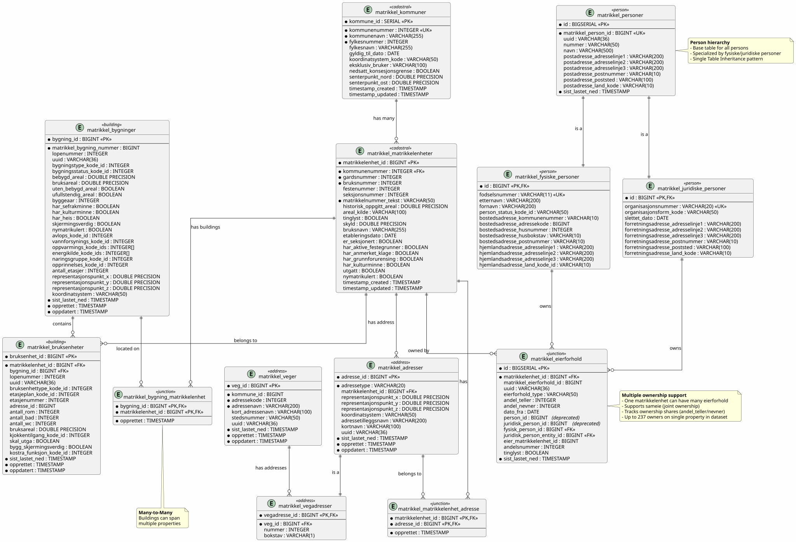

# Matrikkel API Client

A Symfony-based client for accessing the MatrikkelAPI from Kartverket (Norwegian Cadastre). This project provides both SOAP API integration and local database import capabilities for Norwegian address and property data.

## 🚀 Quick Start with Docker

The easiest way to get started is using Docker:

```bash
# 1. Clone and navigate to the project
git clone <repository-url>
cd matrikkel

# 2. Set up your API credentials (see Configuration section below)
cp .env.example .env
# Edit .env with your actual Matrikkel API credentials

# 3. Run the setup script
./docker-setup.sh

# 4. Access the application
# Web interface: http://localhost:8083
# Console commands: docker compose exec app php bin/console list
```

## 📋 Requirements

### Docker Setup (Recommended)

- Docker
- Docker Compose

### Manual Setup

- PHP 8.3+
- Required PHP extensions:
  - `ext-soap` (for SOAP API)
  - `ext-sqlite3` (for local database)
  - `ext-pgsql` (for PostgreSQL support)
  - `ext-ctype`
  - `ext-iconv`
  - `ext-zip`
- Composer

## ⚙️ Configuration

### API Credentials

You need valid Matrikkel API credentials from Kartverket. Configure them in `.env`:

```bash
# Matrikkel API Configuration
MATRIKKELAPI_LOGIN=your_actual_login
MATRIKKELAPI_PASSWORD=your_actual_password
MATRIKKELAPI_ENVIRONMENT=prod  # or 'test' for testing
```

### Environment Variables

- `MATRIKKELAPI_LOGIN` - Your Matrikkel API username
- `MATRIKKELAPI_PASSWORD` - Your Matrikkel API password  
- `MATRIKKELAPI_ENVIRONMENT` - API environment (`prod` or `test`)

## 🔧 Installation

### Docker Installation (Recommended)

```bash
# Build and start containers
docker compose up -d

# View logs
docker compose logs -f

# Run console commands
docker compose exec app php bin/console matrikkel:ping
```

### Manual Installation

```bash
# Install dependencies
composer install

# Install PHP SOAP extension (Ubuntu/Debian)
sudo apt-get install php-soap

# Clear cache
php bin/console cache:clear

# Test the connection
php bin/console matrikkel:ping
```

## 📖 Usage

### Available Console Commands

**Test API connection:**

```bash
php bin/console matrikkel:ping
```

**Import data (complete workflow):**

```bash
# 1) Full import (Phase 1 + Phase 2). Phase 2 step 6 automatically importerer
#    manglende adresser referert fra bruksenheter (orphan resolution):
php bin/console matrikkel:import --kommune=4627 --organisasjonsnummer=964338442

# 2) Kjør hierarki-organisering slik at innganger/lokasjonskoder materialiseres:
php bin/console matrikkel:organize-hierarchy --kommune=4627 --force

# 3) Eksporter Excel (Portico 4-nivå) klart for bruk:
php bin/console matrikkel:export-spreadsheet --kommune=4627 --output=/tmp/export.xlsx
```

**Import data (two-phase, hvis du vil kjøre separat):**

```bash
# Phase 1: Import base data (kommune, matrikkelenheter, personer, eierforhold)
php bin/console matrikkel:phase1-import --kommune=4627 --organisasjonsnummer=964338442

# Phase 2: Import bygg/bruksenheter/adresser (med automatisk orphan resolution i step 6)
php bin/console matrikkel:phase2-import --kommune=4627 --organisasjonsnummer=964338442

# Etter Phase 2: organiser hierarki og eksporter Excel
php bin/console matrikkel:organize-hierarchy --kommune=4627 --force
php bin/console matrikkel:export-spreadsheet --kommune=4627 --output=/tmp/export.xlsx
```

**Debug commands:**

```bash
# Debug matrikkelenhet structure from API
php bin/console matrikkel:debug-matrikkelenhet

# Test NedlastningClient bulk downloads
php bin/console matrikkel:test-nedlastning
```

**Portico hierarchy organization:**

```bash
# Organize 4-level location hierarchy for a municipality
php bin/console matrikkel:organize-hierarchy --kommune=4627

# Organize specific matrikkelenhet
php bin/console matrikkel:organize-hierarchy --kommune=4627 --matrikkelenhet=12345

# Force re-organization (even if already organized)
php bin/console matrikkel:organize-hierarchy --kommune=4627 --force
```

This command assigns deterministic location codes to the 4-level hierarchy:
- **Eiendom** (Property) - Base code (e.g., `5000`)
- **Bygg** (Building) - 2-digit suffix (e.g., `5000-01`, `5000-02`)
- **Inngang** (Entrance) - 2-digit suffix (e.g., `5000-01-01`, `5000-01-02`)
- **Bruksenhet** (Unit) - 3-digit suffix (e.g., `5000-01-01-001`, `5000-01-01-002`)

**Note**: For searching individual addresses, property units, cadastral units, municipalities, or code lists, use the REST API endpoints below instead of console commands.

### REST API Endpoints

The project now includes a comprehensive REST API that provides JSON access to all Matrikkel functionality:

**Base URL**: `http://localhost:8083/api`

**Available Endpoints**:

```bash
# API Documentation
GET /api/endpoints          # List all available endpoints
GET /api/ping               # API health check

# Address Services
GET /api/address/{id}                    # Get address by ID
GET /api/address/search?q={query}       # Search addresses via API
GET /api/address/search/db?q={query}    # Search addresses in local DB
GET /api/address/postal/{postnummer}    # Get postal area

# Municipality Services  
GET /api/municipality/{id}              # Get municipality by ID
GET /api/municipality/number/{number}   # Get municipality by number

# Property Unit Services
GET /api/property-unit/{id}                    # Get property unit by ID
GET /api/property-unit/address/{addressId}     # Get units for address

# Cadastral Unit Services
GET /api/cadastral-unit/{id}                        # Get by ID
GET /api/cadastral-unit/{knr}/{gnr}/{bnr}           # Get by matrikkel number
GET /api/cadastral-unit/{knr}/{gnr}/{bnr}/{fnr}     # With festenummer
GET /api/cadastral-unit/{knr}/{gnr}/{bnr}/{fnr}/{snr} # With section

# Code Lists
GET /api/codelist           # Get all code lists
GET /api/codelist/{id}      # Get specific code list with codes

# Portico Export (4-level hierarchy)
GET /api/portico/export?kommune={kommunenummer}                      # Export all properties in municipality
GET /api/portico/export?kommune={kommunenummer}&organisasjonsnummer={orgnr}  # Filter by owner

# General Search
GET /api/search?q={query}&source=api&limit={number}&offset={start}    # Search via Matrikkel API (pagination support)
GET /api/search?q={query}&source=db     # Search via local database

### Examples

```bash
# Check API status
curl http://localhost:8083/api/ping

# Search for address
curl "http://localhost:8083/api/address/search?q=Bergen"

# Get municipality info
curl http://localhost:8083/api/municipality/4601

# Search with pagination
curl "http://localhost:8083/api/search?q=oslo&source=api&limit=50&offset=0"    # First 50 results
curl "http://localhost:8083/api/search?q=oslo&source=api&limit=50&offset=50"   # Next 50 results  
curl "http://localhost:8083/api/search?q=oslo&source=api&limit=50&offset=100"  # Results 101-150

# Search in local database
curl "http://localhost:8083/api/search?q=Oslo&source=db"

# Export Portico hierarchy for a municipality (JSON)
curl "http://localhost:8083/api/portico/export?kommune=4627"

# Export Portico hierarchy filtered by owner (JSON)
curl "http://localhost:8083/api/portico/export?kommune=4627&organisasjonsnummer=964338442"

# Export Portico hierarchy as Excel spreadsheet
curl -o portico_export.xlsx "http://localhost:8083/api/portico/export/spreadsheet?kommune=4627"

# Export filtered by owner as Excel spreadsheet
curl -o portico_owner.xlsx "http://localhost:8083/api/portico/export/spreadsheet?kommune=4627&organisasjonsnummer=964338442"
```
```

**Example API Usage**:

```bash
# Test API health
curl http://localhost:8083/api/ping

# Search for addresses
curl "http://localhost:8083/api/address/search?q=Bergen"

# Get municipality data  
curl http://localhost:8083/api/municipality/4601

# Search with pagination - get results beyond 100
curl "http://localhost:8083/api/search?q=oslo&source=api&limit=50&offset=0"    # First 50 results
curl "http://localhost:8083/api/search?q=oslo&source=api&limit=50&offset=50"   # Next 50 results  
curl "http://localhost:8083/api/search?q=oslo&source=api&limit=50&offset=100"  # Results 101-150

# Search with local database
curl "http://localhost:8083/api/search?q=Oslo&source=db"

```

### Spreadsheet Export Feature

The project includes Excel spreadsheet export for the Portico 4-level hierarchy:

**REST API Endpoint:**
```bash
GET /api/portico/export/spreadsheet
```

**Query Parameters:**
- `kommune` (optional): 4-digit municipality number (e.g., 4627)
- `organisasjonsnummer` (optional): Organization number to filter by owner

**Examples:**
```bash
# Export all properties
curl -o portico_export.xlsx "http://localhost:8083/api/portico/export/spreadsheet"

# Export specific municipality
curl -o askoy_export.xlsx "http://localhost:8083/api/portico/export/spreadsheet?kommune=4627"

# Export filtered by owner
curl -o org_export.xlsx "http://localhost:8083/api/portico/export/spreadsheet?kommune=4627&organisasjonsnummer=964338442"
```

**Spreadsheet Structure:**

The exported file contains 4 tabs (one per hierarchy level):

1. **Eiendom** (Properties)
   - Columns: loc1, loc2, loc3, loc4, lokasjonskode, matrikkelenhet_id, matrikkelnummer_tekst, kommunenummer, areal

2. **Bygg** (Buildings)
   - Columns: loc1, loc2, loc3, loc4, lokasjonskode, bygning_id, matrikkel_bygning_nummer, lopenummer_i_eiendom, bygningstype_kode_id, antall_etasjer, bruksareal, byggeaar, representasjonspunkt_x, representasjonspunkt_y

3. **Inngang** (Entrances)
   - Columns: loc1, loc2, loc3, loc4, lokasjonskode, inngang_id, gatenavn, husnummer, bokstav, veg_id, adressekode, lopenummer_i_bygg

4. **Bruksenhet** (Dwelling Units)
   - Columns: loc1, loc2, loc3, loc4, lokasjonskode, bruksenhet_id, lopenummer_i_inngang, bruksenhettype_kode_id, etasjeplan_kode_id, etasjenummer, antall_rom, bruksareal

**Features:**
- ✓ `lokasjonskode` automatically split into loc1, loc2, loc3, loc4 columns
- ✓ Headers formatted with blue background and white text
- ✓ Auto-width columns for readability
- ✓ Supports filtering by municipality and owner
- ✓ Automatic filename with timestamp

**Alternative: CLI Command**
```bash
php bin/console matrikkel:export-spreadsheet \
  --kommune=4627 \
  --organisasjonsnummer=964338442 \
  --output=export.xlsx
```

All endpoints return JSON with this structure:

```json
{
  "data": { ... },
  "timestamp": "2025-10-03T13:57:21+00:00", 
  "status": "success"
}
```

### Docker Commands

```bash
# Start containers
docker compose up -d

# Stop containers  
docker compose down

# View logs
docker compose logs -f

# Run console commands
docker compose exec app php bin/console <command>

# Access container shell
docker compose exec app bash

# Rebuild containers
docker compose build --no-cache
```

## 💾 Local Database Import

### Import Commands

The project provides a unified import command that handles all data import in two phases:

**Phase 1** (Base Data):
- Kommune (municipality)
- Matrikkelenheter (cadastral units/properties)
- Personer (owners - physical and legal persons)
- Eierforhold (ownership relations)

**Phase 2** (Building Data):
- Veger (roads/streets)
- Bruksenheter (property units)
- Bygninger (buildings)
- Adresser (addresses)

**Basic Usage**:

```bash
# Full import for a municipality with owner filter
php bin/console matrikkel:import --kommune=4627 --organisasjonsnummer=964338442

# Test with limited data
php bin/console matrikkel:import --kommune=4627 --organisasjonsnummer=964338442 --limit=10

# Import only Phase 1 (base data)
php bin/console matrikkel:import --kommune=4627 --skip-phase2

# Import only Phase 2 (building data)
php bin/console matrikkel:import --kommune=4627 --skip-phase1
```

**Available Options**:

- `--kommune=XXXX` - Required: 4-digit municipality number
- `--organisasjonsnummer=XXXXXX` - Filter by organization number (owner)
- `--limit=N` - Limit number of matrikkelenheter to import (for testing)
- `--skip-phase1` - Skip Phase 1, only run Phase 2
- `--skip-phase2` - Skip Phase 2, only run Phase 1

**Example: Full Import for Askøy Kommune**:

```bash
php bin/console matrikkel:import --kommune=4627 --organisasjonsnummer=964338442
```

This will import:
- 1 kommune
- 693 matrikkelenheter
- 442 personer
- 329 veger
- 879 bruksenheter
- 692 bygninger
- 263 adresser

**Performance**:
- Phase 1: ~12 seconds (base data)
- Phase 2: ~23 seconds (building data)
- Total: ~35 seconds for complete dataset

### Legacy Commands

The individual phase commands are still available if you need more control:

```bash
# Run Phase 1 only
php bin/console matrikkel:phase1-import --kommune=4627 --organisasjonsnummer=964338442

# Run Phase 2 only
php bin/console matrikkel:phase2-import --kommune=4627 --organisasjonsnummer=964338442
```

### Database Schema

The project uses PostgreSQL to store imported data. The complete schema includes 7 primary tables:

- **`matrikkel_kommuner`** - Norwegian municipalities
- **`matrikkel_matrikkelenheter`** - Cadastral units (properties)
- **`matrikkel_personer`** - Property owners (physical and legal persons)
- **`matrikkel_eierforhold`** - Ownership records (junction table)
- **`matrikkel_veger`** - Roads/streets
- **`matrikkel_bygninger`** - Buildings with detailed property data
- **`matrikkel_bruksenheter`** - Property units (apartments, etc.)
- **`matrikkel_adresser`** - Addresses

**Visual Schema Diagram**:



For the complete database schema, see `migrations/V1__baseline_schema.sql`.

## 🔗 API Reference

### MatrikkelAPI Documentation

- **Production API**: <https://prodtest.matrikkel.no/matrikkelapi/wsapi/v1/dokumentasjon/index.html>
- **Test Environment**: Available through Kartverket

### SOAP Services Available

- **AdresseClient** - Address lookup and search
- **BruksenhetClient** - Property units
- **KommuneClient** - Municipality data
- **KodelisteClient** - Code lists and references
- **MatrikkelenhetClient** - Cadastral units
- **MatrikkelsokClient** - General cadastre search

## 🐛 Troubleshooting

### Common Issues

**SOAP Extension Missing**:

```bash
# Ubuntu/Debian
sudo apt-get install php-soap

# CentOS/RHEL
sudo yum install php-soap
```

**Permission Issues with Docker**:

```bash
# Fix file permissions
sudo chown -R $USER:$USER ./var
chmod -R 775 ./var
```

**API Connection Issues**:

1. Verify your credentials in `.env`
2. Test with: `php bin/console matrikkel:ping`
3. Check if you're using the correct environment (`prod` vs `test`)

**Cache Issues**:

```bash
# Clear Symfony cache
php bin/console cache:clear

# With Docker
docker compose exec app php bin/console cache:clear
```

**Coordinate Transformation Notice**:

The current implementation includes a basic stub for coordinate transformations (UTM ↔ Lat/Long). For production use requiring precise coordinate transformations, consider implementing a proper coordinate transformation library or service.

## 🧪 Testing

The project includes comprehensive test coverage:

### Running Tests

**Run all tests:**

```bash
php bin/phpunit

# With Docker
docker compose exec app php bin/phpunit
```

**Run specific test suites:**

```bash
# Unit tests only
php bin/phpunit tests/Unit/

# Integration tests only
php bin/phpunit tests/Integration/

# Console command tests
php bin/phpunit tests/Integration/Console/

# REST API tests
php bin/phpunit tests/Integration/Api/
```

**Run specific test file:**

```bash
php bin/phpunit tests/Unit/Service/HierarchyOrganizationServiceTest.php
```

### Test Coverage

The test suite includes:

- **Unit Tests** (8 tests) - Code formatting, sorting algorithms, validation logic
- **Console Integration Tests** (8 tests) - CLI command functionality
- **API Integration Tests** (5 tests) - REST endpoint validation

**Total: 21 tests** covering critical functionality

### Test Structure

```text
tests/
├── Unit/
│   └── Service/
│       └── HierarchyOrganizationServiceTest.php
├── Integration/
│   ├── Console/
│   │   └── OrganizeHierarchyCommandTest.php
│   └── Api/
│       └── PorticoExportControllerTest.php
└── bootstrap.php
```

### Coverage Reports

Generate HTML coverage report:

```bash
php bin/phpunit --coverage-html coverage/
```

View the report by opening `coverage/index.html` in your browser.

## 📝 Development

### Project Structure

```text
src/
├── Client/          # SOAP client implementations
├── Console/         # Symfony console commands  
├── Controller/      # REST API controllers
├── Entity/          # Data entities
├── LocalDb/         # Local database services
└── Service/         # Business logic services
```

### Adding New Commands

Extend `AbstractCommand` class and place in `src/Console/` directory.

### Service Configuration

Services are configured in `config/services.yaml` using the factory pattern for SOAP clients.

## 📄 License

GPL-3.0-or-later — see the full text in [LICENSE](LICENSE).

## 🤝 Contributing

1. Fork the repository
2. Create a feature branch
3. Make your changes
4. Add tests if applicable
5. Submit a pull request

---

For more information about the Norwegian Cadastre system, visit [Kartverket](https://www.kartverket.no/).
